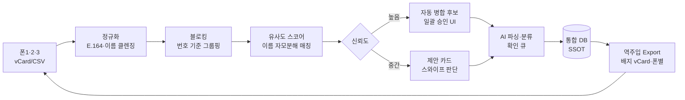
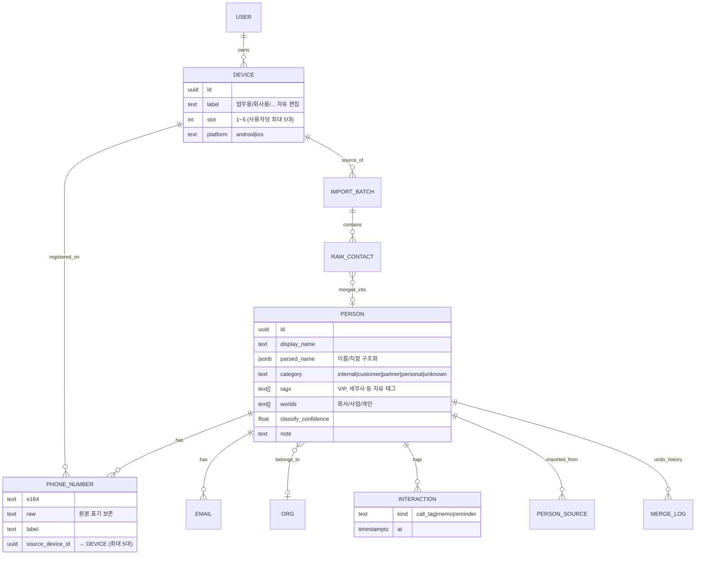

# 📇 누구지 (가칭) — 흩어진 연락처 정제 & 발신자 관계 식별 서비스 기획서

> **"벨이 울리는 순간, 누구인지 · 나와 무슨 관계인지 3초 안에 안다."**

| 항목 | 내용 |
|---|---|
| 문서 버전 | v0.3 (초안) |
| 작성일 | 2026-07-12 |
| 상태 | 아이디어 융합 완료 · 사용자 검증(친구 인터뷰) 전 |
| 지원 범위 | **폰 1~5대** (1인이 여러 대의 개인·업무용 폰을 통합) |
| 가칭 후보 | **누구지 (Who's This)** ← 추천 / 콜택 (CallTag) / 링노트 (RingNote) |

---

## 1. 한 줄 정의

**여러 대의 폰(최대 5대)에 흩어진 연락처를 하나로 정제하고, 전화가 오는 순간 상대가 "직원인지 · 고객인지 · 거래처인지"를 즉시 보여주는 개인용 연락처 인텔리전스 서비스.**

> 특정 한 사람을 위한 도구가 아니라, **폰을 여러 대 쓰는 누구나** 쓸 수 있는 범용 제품. 대표 페르소나(§2.1)는 폰 3대를 쓰지만, 제품은 **1대부터 5대까지** 유연하게 통합한다. (영업직·중개사·프리랜서는 개인폰 1 + 업무폰 1 조합이 흔하고, 사업 규모가 크면 4~5대까지 늘어난다.)

핵심 포지셔닝 — 기존 전화 앱들과 정반대 방향:

> 후스콜·T전화는 **"모르는 번호"**(스팸)를 식별한다.
> 누구지는 **"아는 번호"**(내 사람들)를 식별한다. 소스는 공용 스팸 DB가 아니라 **내 데이터**다.

---

## 2. 배경과 문제 정의

### 2.1 대표 페르소나: "멀티폰 사장님" — 여럿 중 한 명

> 아래는 가장 뾰족한 대표 사례(폰 3대)다. 제품은 이 한 명이 아니라 **폰을 2~5대 쓰는 사용자 전반**을 겨냥한다. 타깃 스펙트럼은 §15 참고.

- 사업체를 운영하며 여러 대의 폰(예: 업무용 / 회사용 / 사업용)을 들고 다님
- 연락처 수천 개가 여러 대에 분산 — 같은 사람이 폰마다 다른 이름으로 중복 저장
- 저장 형식이 제각각: `김부장`, `김부장님2`, `★박사장(공장)`, `010-9999-0000 견적문의`
- 전화가 오면 **누군지 몰라서 받을지 말지 3초 고민** → 중요한 고객 전화를 놓치거나, 받고 나서 한참 동안 상대를 추측

**다른 타깃 예시**: 개인폰+업무폰 2대를 쓰는 영업직·보험설계사·부동산 중개사, 부업을 병행해 폰이 3~4대인 자영업자, 기기별로 용도를 나눈 프리랜서. 공통점은 **"폰이 2대 이상 + 연락처가 뒤섞임"**.

### 2.2 Pain Points

| # | 문제 | 결과 |
|---|---|---|
| P1 | 같은 사람이 폰 여러 대에 각각 다른 이름으로 저장 (중복·불일치) | 어느 정보가 최신인지 모름 |
| P2 | 이름만 봐서는 관계를 알 수 없음 — "김대리"가 우리 직원? 거래처? | 전화 응대 톤·내용을 못 정함 |
| P3 | 폰·유심을 바꿀 때마다 엉킴이 가중 | 정리 엄두를 못 냄 (수천 건) |
| P4 | 지난 통화 맥락(무슨 얘기 했는지)이 기억 안 남 | 같은 걸 다시 묻고, 신뢰 하락 |
| P5 | 한 번 정리해도 새 번호가 계속 유입 → 3개월 뒤 원상복구 | 1회성 정리는 해법이 아님 |

**P5가 제품의 본질을 결정한다.** 이 서비스는 "1회성 청소 도구"가 아니라 **정리(1회) + 유지(반복 루프)** 두 모드를 가진 시스템이어야 한다.

---

## 3. 기존 서비스와의 차별점

| 서비스 | 잘하는 것 | 우리 문제를 못 푸는 이유 |
|---|---|---|
| 후스콜 / T전화(에이닷) | 스팸·사기 번호 식별 (공용 DB) | "나와의 관계"는 모름. 내 주소록을 정리해주지 않음 |
| 리멤버 | 명함 디지털화, 비즈니스 인맥 | 명함 없는 연락처(현장 번호, 오래된 거래처, 지인)가 대부분인 실제 폰북은 커버 못함 |
| 구글 주소록 | 백업, 단순 중복 병합 | 이름 동일성 기준의 기계적 병합뿐. 관계 분류 없음, 다계정(여러 폰) 통합이 불편 |
| 기본 연락처 앱 (iOS/갤럭시) | 기기 내 관리 | 여러 대 폰 통합 자체가 불가 |
| 에이닷 통화요약 · Galaxy AI | 통화 녹음·AI 요약 | 요약이 그 폰 안에 고립 — 관계 분류, 멀티폰 통합 타임라인, 다음 수신 화면과 연결되지 않음 |

**우리 자리 = "멀티폰 통합 정제" × "관계 분류" × "수신 순간 표시"** — 세 가지를 동시에 하는 서비스가 없다.

---

## 4. 핵심 컨셉: 아이디어 융합

| 출처 | 아이디어 | 융합 후 위치 |
|---|---|---|
| **원안** | 여러 폰의 흩어진 연락처 데이터 정제 | 핵심 파이프라인: 가져오기 → 정규화 → 중복 병합 (§8) |
| **원안** | 관계 분류 — 동료 / 고객 / 타 기업 | 5+α 카테고리 체계 + 색 배지 (§5.2) |
| **추가 ①** | **네이티브 역주입 배지** — 정제·분류된 이름을 각 폰 기본 주소록에 되돌려 넣으며 이름에 배지를 부착: `🟡김철수·삼성전자` | **MVP 킬러 기능.** 앱 설치 없이, 아이폰이든 갤럭시든, **기본 수신 화면이 그대로 관계를 보여줌** (§6) |
| **추가 ②** | **AI 이름 파서** — `★박사장(공장)` 같은 한국식 연락처명을 LLM이 {이름/직함/회사/관계 힌트}로 구조화 | 정제 파이프라인의 두뇌 (§8.2) |
| **추가 ③** | **통화 직후 3초 기록** — 통화 종료 감지 → 원탭 태그·음성메모 → 다음 수신 때 "지난 통화: 견적 문의" 표시 | Phase 2, 미니 CRM의 씨앗 |
| **추가 ④** | **멀티폰 동기화 + 폰별 배포 정책** — 서버가 단일 원본(SSOT), 등록된 폰(최대 5대)은 뷰. "사업용 폰엔 사업 연락처만" 같은 선택 배포 가능 | Phase 2 |
| **추가 ⑤** | **유지 루프** — 통화기록의 미저장 신규 번호를 모아 "이 번호 누구였어요?" 주 1회 5분 리뷰 | P5(재오염) 해결. 서비스가 계속 쓰이는 이유 |
| **추가 ⑥** | **초성 검색** (`ㄱㅊㅅ` → 김철수) + 회사·카테고리 필터 | 통합 주소록 UX 기본기 |
| **원안 (7/12 추가)** | **AI 통화 요약** — 통화 녹음을 AI가 요점 정리하고, 상대가 누구인지 파악해 저장. 분석 여부는 통화마다 사용자가 알림 버튼으로 동의 | Phase 2.5 신설 (§8.3). 정제 포인트: 앱이 직접 녹음하지 않고 **기기 내장 녹음 활용**, 알림은 종료 직후, 분석 후 음성 자동 삭제 |

### 왜 "역주입"이 MVP의 열쇠인가

수신 화면에 정보를 띄우는 전용 앱은 OS 제약이 크다(§6). 그런데 **정제된 이름을 기본 주소록에 되돌려 넣기만 하면**, 어떤 폰이든 기본 전화 앱이 `🟡고객·김철수·삼성전자`를 표시한다. 즉 **웹앱만으로 Day 1에 핵심 가치("전화 오면 누군지 안다")를 전달**할 수 있고, 전용 앱(오버레이)은 Phase 2에서 심화 기능으로 얹으면 된다. 앱 심사·권한 리스크를 뒤로 미루는 전략이기도 하다.

---

## 5. 사용자 시나리오 & 분류 체계

### 5.1 핵심 시나리오 3개

**시나리오 A — 최초 정리 (Day 1, 목표 소요 10분 + 검토)**
1. 쓰는 폰 전부(최대 5대)에서 연락처 내보내기 (vCard 파일 또는 Google 계정 연결)
2. 웹앱에 업로드 → 자동 정규화·중복 감지
3. 병합 제안을 카드 UI로 검토 (확실한 건 일괄 승인, 애매한 것만 스와이프 판단)
4. AI 분류 제안 검토 → 카테고리 확정
5. 배지 규칙을 골라 **정제본을 각 폰에 역주입** (주입 전 원본 자동 백업)

**시나리오 B — 전화 수신 (매일 수십 번, 핵심 순간)**
- MVP: 기본 수신 화면에 `🟡김철수·삼성전자` 표시 → 받기 전에 관계 파악 완료
- Phase 2 (Android): 오버레이 카드 — `🟡 고객 | 김철수 · 삼성전자 구매팀 | 지난 통화 6/30: 견적 문의`

**시나리오 C — 통화 종료 후 (Phase 2)**
- "방금 통화, 어떤 용건이었나요?" → 원탭 태그 `[견적] [발주] [CS] [개인]` + 선택적 음성메모
- 필요 시 팔로업 리마인더 ("금요일에 견적서 보내기")

### 5.2 관계 카테고리 체계

| 배지 | 카테고리 | 예 |
|---|---|---|
| 🟢 | 내부 — 직원·동료 | 우리 회사 직원, 같이 일하는 팀 |
| 🟡 | 고객 | 물건·서비스를 사가는 쪽 |
| 🔵 | 협력·거래처 | 납품처, 외주, 공급사, 타 기업 파트너 |
| 🟣 | 개인 | 가족, 친구, 지인 |
| ⚪ | 미확인 | 아직 분류 전 (자동 분류 신뢰도가 낮으면 여기 유지) |

- 기본 5종 + **자유 태그** (예: `VIP`, `세무사`, `현장`, `은행`) — 사장님마다 세계가 달라서 커스텀은 필수
- 한 사람이 **여러 세계(회사/사업/개인)에 동시 소속 가능** — 카테고리와 별개 축

---

## 6. 발신자 식별 전략 (OS 현실 제약 포함)

정직한 기술 검토 — 여기가 가장 오해하기 쉬운 지점이다.

| 단계 | 방식 | 플랫폼 | 제약 |
|---|---|---|---|
| **1단계 (MVP)** | **네이티브 역주입 배지** — 정제 이름을 기본 주소록에 씀 | **모든 폰, 앱 불필요** | 표시는 이름 문자열뿐 (맥락 카드 없음). 이모지 접두사는 가나다 정렬 영향 → 접미사·텍스트 배지 옵션 제공 (부록 B) |
| 2단계 (P2) | Android 수신 **오버레이 카드** — CallScreeningService + 오버레이 권한 | Android | Play 스토어 전화 권한 정책 검토 필요. 친구 1인용이면 사이드로드로 정책 우회 가능 |
| 3단계 (P3) | iOS **Call Directory Extension** — 번호→라벨 정적 주입 | iOS | **실시간 조회 불가** (동기화 시점에만 라벨 갱신), 오버레이 불가. iOS에서는 1단계 역주입이 사실상 주력 |

> 결론: **1단계만으로 문제의 80%가 풀린다.** 2·3단계는 "맥락(지난 통화 내용)까지 보여주는" 심화다.

> ✅ **2026-07-12 확인: 첫 베타 사용자의 폰 3대는 모두 Android.** 이 사용자 기준 3단계(iOS)는 당분간 불필요하고, 2단계 오버레이가 그의 폰 전부에 적용 가능 — Phase 2의 실현 확실성이 크게 올라갔다. (단 제품은 iOS 사용자도 대상이므로 3단계는 로드맵에 유지.)

---

## 7. 기능 정의 (MoSCoW)

### Must — Phase 1 웹 MVP

- [ ] **다중 소스 가져오기**: vCard(.vcf) / CSV 업로드 (폰 1~5대 각각), 폰 추가·삭제·라벨링 (기본 라벨: 업무용/회사용/사업용/개인용/예비폰, 자유 편집 가능)
- [ ] **정규화**: 전화번호 E.164 통일 (010/02/070/15xx 대표번호 처리), 공백·특수문자 정리
- [ ] **중복 병합 엔진**: 번호 일치(자동 병합 후보) / 이름 유사 + 번호 상이(제안만) — 신뢰도 점수, 병합 미리보기, **실행취소 로그**
- [ ] **AI 파싱 & 분류**: 연락처명 구조화 + 카테고리 제안. **자동 확정 금지 — 반드시 확인 큐 통과**
- [ ] **통합 주소록**: 초성 검색, 카테고리·세계·소스폰 필터
- [ ] **역주입 내보내기**: 배지 규칙 선택 → vCard 다운로드 (폰별 파일) + **주입 전 전체 백업 스냅샷 & 원클릭 복원 안내**

### Should — Phase 2

- [ ] Google People API 연동 (읽기/쓰기 자동화 — 파일 업로드 대체)
- [ ] Android 앱: 수신 오버레이, 통화 종료 후 퀵 태그
- [ ] 멀티폰 실시간 동기화 + 폰별 배포 정책
- [ ] 인터랙션 타임라인(통화 태그·메모·리마인더)
- [ ] **유지 루프**: 미저장 신규 번호 주간 리뷰 ("이 번호 누구였어요?")
- [ ] 명함 촬영 OCR 등록
- [ ] **AI 통화 요약 (Phase 2.5)**: 통화 종료 알림 → 건별 동의 → 요점·할 일·화자 정보 추출 (§8.3)

### Could — Phase 3

- [ ] iOS Call Directory 라벨 확장
- [ ] 자연어 검색 ("지난달 통화한 고객 중 견적 안 보낸 사람")
- [ ] 팀 공유 (직원과 거래처 연락처 공유), 미니 CRM
- [ ] 스팸 DB 연동 (미확인 번호 보조 식별)

### Won't — 당분간 안 함

- 앱이 직접 수행하는 통화 녹음 — OS·스토어 정책상 사실상 불가. **기기 내장 녹음 활용**으로 대체 (§8.3)
- 문자/메신저 내용 분석 (민감도 대비 효용 낮음)

---

## 8. 정제 파이프라인 (제품의 심장)



### 8.1 중복 판정 규칙 (초안)

| 조건 | 판정 |
|---|---|
| E.164 번호 동일 | 같은 사람 확정 → 자동 병합 후보 (이름 충돌 시 어떤 이름 남길지 선택) |
| 이름 유사 (자모 분해 유사도 ≥ 임계) + 번호 다름 | **제안만** — "한 사람의 폰 2대"인지 "동명이인"인지 사람이 판단. 사장님 세계에선 한 사람이 번호 2~3개인 게 정상이므로 병합해도 번호는 모두 보존 |
| 이름만 동일, 다른 근거 없음 | 병합 안 함 (동명이인 위험) |

### 8.2 AI 이름 파서 — 이 제품의 차별화 두뇌

한국 연락처명은 사실상 자유 텍스트 필드다. LLM 배치 호출로 구조화한다:

```
입력: "★김부장님(공장)"        → { 이름: "김OO", 직함: "부장", 회사힌트: "공장", 제안: 🔵협력, 신뢰도: 낮음 → ⚪확인 필요 }
입력: "이과장 삼전"            → { 이름: "이OO", 직함: "과장", 회사: "삼성전자(추정)", 제안: 🔵, 신뢰도: 중간 }
입력: "010-9999-0000 견적문의" → { 이름: 없음, 메모: "견적 문의", 제안: 🟡고객(리드), 신뢰도: 낮음 }
입력: "민수엄마"               → { 관계: 개인 지인, 제안: 🟣개인, 신뢰도: 높음 }
```

- 규칙 기반 1차 (직함 사전, 회사명 사전, 이메일 도메인) → LLM 2차 (애매한 것만) → 비용 최소화
- **LLM 결과는 항상 '제안'** — 확인 큐에서 사람이 확정. 오분류(직원을 고객으로)가 신뢰를 깨는 최악 시나리오이므로 자동 확정은 금지

### 8.3 AI 통화 요약 파이프라인 (Phase 2.5 — 2026-07-12 원안 추가)

원칙: **앱은 녹음하지 않는다. 폰이 녹음하고, 앱은 동의받은 것만 읽는다.**

구글 정책상 서드파티 앱의 통화 녹음은 사실상 막혀 있다(2022년 접근성 API 우회까지 차단). 대신 국내 갤럭시에는 통화 자동 녹음이 내장되어 있고, 녹음 파일이 정해진 폴더(`Recordings/Call`)에 상대 번호가 포함된 파일명으로 저장된다. 우리는 이 파일을 읽는 것으로 충분하다 — 스토어 정책 리스크가 크게 줄어든다.

```
통화 종료 감지 (Phase 2 오버레이 앱이 이미 전화 상태를 감지 중)
 → 알림 자동 발송: "방금 통화(4분 12초), 요점 정리할까요?"  [정리하기] [안 할래요]  ← 통화별 사용자 동의
 → [정리하기] 탭 (1탭): 내장 녹음 파일 읽기 → STT(음성→텍스트) → LLM 요약
 → 결과: 요점 3줄 · 할 일(+리마인더 제안) · 상대 정보 추출
 → 저장: 그 사람 타임라인에 텍스트만 보관 → 다음 수신 때 오버레이에 "지난 통화: ..." 자동 표시
 → 음성 파일: 분석 후 앱 보관본 즉시 삭제 (기본값)
```

**"누구인지 저장"** — 상대 정보 추출이 원안의 핵심이다:
- 모르는 번호와의 통화에서 상대가 "을지로조명 박 사장입니다"라고 소개하면 → 주간 리뷰 카드에 "통화에서 '을지로조명 박사장'이라고 소개했어요 → [이대로 저장]" 프리필. 미확인 번호 정리가 탭 1번으로 준다
- 아는 번호면 → 요약이 타임라인에 쌓여 시나리오 C(수동 태그)를 자동화한다

알림 시점에 대한 정제: 원안은 "전화가 오면 알림"이었으나, 분석 대상(녹음 파일)은 통화가 끝나야 생기므로 **알림은 종료 직후**가 기술적으로 정확하고, 통화 중 방해도 없다. 동의 UX는 원안 그대로 — 알림의 버튼 하나로 결정한다.

법적·개인정보 원칙:
- 본인이 참여한 통화의 녹음은 한국에서 합법(통신비밀보호법상 당사자 녹음). 단 상대방 음성을 서버에서 처리하므로: **통화별 명시 동의(버튼)**, 분석 후 **음성 즉시 삭제**, **텍스트 요약만 보관**, 요약의 외부 유포 금지 고지
- STT·LLM 비용은 통화 10분당 100원 안팎 — 건별 동의 구조라 필요한 통화만 분석되어 비용도 자연 통제됨

---

## 9. 데이터 모델 (요약)



원칙: **원본(raw)은 절대 파괴하지 않는다.** 모든 병합·수정은 `MERGE_LOG`로 되돌릴 수 있어야 신뢰를 얻는다.

`DEVICE.slot`은 1~5로 제한(사용자당 최대 5대). 폰 개수는 사용자마다 다르므로 UI·역주입·동기화는 **폰 개수에 무관하게(N=1~5) 동작**하도록 설계 — 특정 개수(3)를 가정하지 않는다.

---

## 10. 아키텍처 & 기술 스택

이 리포에서 이미 검증된 스택과 정합시켜 학습 비용 없이 바로 착수 가능하게 구성:

| 레이어 | 선택 | 비고 |
|---|---|---|
| 웹 프론트/백엔드 | **Next.js (App Router) + Vercel** | 현재 리포와 동일 스택 |
| DB·인증 | **Supabase (Postgres + RLS) + Prisma** | 사용자별 데이터 격리(RLS), Phase 2 Realtime 동기화까지 커버 |
| 전화번호 정규화 | `google-libphonenumber` | KR 국번·대표번호 처리 |
| 한글 처리 | `es-hangul` (초성 검색, 자모 분해 유사도) | |
| AI | LLM API 배치 호출 (Gemini — 기존 `GOOGLE_AI_API_KEY` 운용 경험 / 또는 Claude) | 애매 건만 호출해 비용 절감 |
| 모바일 (P2) | React Native(Expo) + 네이티브 모듈(CallScreeningService) | JS/TS 역량 재사용, Android 우선 |

**Google People API 참고**: 연락처 스코프는 민감 스코프라 정식 배포엔 OAuth 심사가 필요하다. 개인 프로젝트 단계에선 **테스트 모드에 본인·친구 계정만 등록하면 심사 없이 즉시 사용 가능** → Phase 1은 파일 업로드, Phase 2 초입에 테스트 모드 연동이 현실적.

---

## 11. 개인정보 보호 & 보안 (한국 기준)

연락처는 **제3자의 개인정보**다. 개인정보보호법 관점에서 처음부터 설계에 반영한다.

1. **최소 수집**: 이름·번호·회사·메모만. 통화 내용·문자 미수집
2. **암호화**: 전송(TLS) + 저장(at rest) 암호화, Supabase RLS로 계정 간 완전 격리
3. **LLM 전송 최소화**: 파싱에 필요한 이름·메모 텍스트만 전송, **전화번호는 마스킹/미전송**. 처리 위탁 사실 고지
4. **삭제권**: 계정 삭제 = 전체 데이터 즉시 파기 (백업 포함 정책 명시)
5. **로컬 우선 옵션 (검토)**: 서버 업로드 없이 브라우저 내에서만 정제하는 모드 — 초기 신뢰 확보용. 단, 멀티폰 동기화와 상충하므로 "정제만 로컬 / 동기화는 서버" 하이브리드로 설계

---

## 12. 로드맵

| Phase | 기간(추정) | 내용 | 완료 판정 |
|---|---|---|---|
| **0. 검증** | 1주 | 친구 인터뷰(§14 열린 질문), 실제 연락처 30~50건 샘플로 파서·병합 프로토타입 검증 | "이 정도면 쓰겠다" 확인 + OS 구성 파악 |
| **1. 웹 MVP** | 3~4주 | 폰 추가(1~5대) → 가져오기 → 정제 → 분류 → **역주입**. 첫 베타 사용자가 본인 폰 전부에 적용 | 베타 1인이 등록한 폰 전부를 정제본으로 교체 |
| **2. 앱 + 루프** | 4~6주 | Android 오버레이, 통화 후 태그, Google 연동 자동 동기화, 주간 리뷰 루프 | 베타 사용자가 2주 연속 자발적 사용 |
| **2.5 통화 요약** | 2~3주 | 종료 알림 → 건별 동의 → STT·요약 (§8.3), 타임라인·주간 리뷰 프리필 연결 | 사용자가 "정리하기" 버튼을 계속 누르는가 |
| **3. 확장** | 이후 | iOS 라벨, 팀 공유, 미니 CRM, **일반 사용자 오픈** | 폰 개수·직군이 다른 베타 5인이 각자 정착 |

**북극성 지표**: "누군지 몰라서 전화를 못 받거나 잘못 응대한 횟수" — 주 N회 → **0회**

보조 KPI:
- 벨 울림 → 발신자 인지 시간: 3초 이내
- 중복 그룹 해소율 ≥ 95%, AI 분류 제안 수정률 < 10%
- (P2) 등록된 폰 전체 동기화 반영 < 1분, 주간 리뷰 완료율 ≥ 80%

---

## 13. 리스크 & 대응

| 리스크 | 영향 | 대응 |
|---|---|---|
| 스토어 전화 권한 정책 (Play/App Store) | 오버레이 기능 배포 차단 | **역주입 우선 전략으로 의존도 낮춤**. 1인용은 사이드로드, 배포 시 '기본 발신자 ID 앱' 역할 신청 |
| iOS 실시간 표시 불가 | 아이폰 사용자 기대치 | Call Directory 라벨 + 역주입 조합으로 커버, 기대치 사전 관리 |
| **오분류** (직원을 고객으로 표시) | 신뢰 붕괴 — 최악 시나리오 | 자동 확정 금지, 확인 큐, 저신뢰는 ⚪ 유지, 수신 화면엔 확정 건만 배지 |
| **역주입 사고** (주소록 오염·유실) | 복구 불가 시 치명적 | 쓰기 전 **전체 vCard 스냅샷 자동 백업 + 원클릭 복원**. 첫 주입은 소량 테스트 → 전체 |
| 이모지 배지의 정렬·검색 간섭 | 사용성 저하 | 접미사형·텍스트형 `[고객]` 옵션 제공 (부록 B) |
| 개인정보 민감성 | 법적·신뢰 리스크 | §11 원칙 + 로컬 우선 옵션 |
| 정리 후 재오염 (P5) | 서비스 이탈 | 유지 루프(주간 리뷰)를 Phase 2 최우선으로 |
| 통화 요약의 제조사 의존 (갤럭시 내장 녹음 전제) | 갤럭시가 아닌 폰에선 동작 불가 | Phase 0에서 제조사 확인(§14), 미지원 폰은 수동 태그로 폴백 |
| 음성 데이터 민감성 | 최고 민감도 개인정보 | 통화별 동의 버튼, 분석 후 즉시 삭제, 텍스트만 보관 (§8.3) |

---

## 14. 열린 질문 — 베타 사용자에게 확인할 것 (Phase 0)

> 첫 검증 대상은 지인(폰 3대)이지만, 제품은 범용이므로 다른 폰 개수·직군의 사용자로 넓혀가며 반복 확인한다.

1. ~~**폰의 OS 구성은?**~~ → ✅ **첫 사용자 확인됨 (2026-07-12): 폰 3대 모두 Android.** Phase 2 오버레이 전략 유효. iOS 사용자 대상 검증은 Phase 3에서 별도 진행
2. 연락처 총 규모와 직원 수는? → 카테고리 세분화 필요성
3. 폰별 용도 구분 기준은? **폰별로 연락처를 나눠 담고 싶은지, 모든 폰에 통합본을 원하는지?** (폰별 배포 정책 설계에 반영)
4. 리멤버·후스콜을 써봤는지, 왜 부족했는지?
5. 식별까지만 원하는지, 통화 후 기록(미니 CRM)까지 원하는지?
6. 연락처 데이터를 서버에 올리는 것에 대한 심리적 저항은? (로컬 우선 모드 필요성)
7. **폰의 제조사는?** (갤럭시 여부 — AI 통화 요약(§8.3)은 내장 통화 녹음 기능이 전제. 자동 녹음 설정이 켜져 있는지도 확인)
8. **폰을 몇 대 쓰는지?** (제품은 1~5대 지원 — 실제 분포를 파악해 기본 라벨·온보딩 최적화)

---

## 15. 수익 모델 & 타깃 (범용 제품)

첫 검증은 지인 1명으로 하되, 목표는 **같은 페인을 가진 시장 전체**다. 타깃 스펙트럼(폰 개수 기준):

| 폰 개수 | 대표 직군 | 특징 |
|---|---|---|
| 2대 | 영업직, 보험설계사, 부동산 중개사, N잡러 | 개인폰 + 업무폰. 가장 넓은 저변 |
| 3대 | 소상공인·자영업 사장 (대표 페르소나) | 업무/회사/사업 분리 |
| 4~5대 | 다점포 운영자, 유통·무역, 기기별 용도 분리 프리랜서 | 헤비 유저. 정제 가치가 가장 큼 |

공통점: **"폰이 2대 이상 + 연락처가 뒤섞임"**. 폰 1대 사용자도 "중복·미분류 정리 + 관계 배지"만으로 가치가 있어 진입점으로 활용.

- **Free**: 폰 2대까지 · 연락처 500건 · 수동 정제
- **Pro (구독)**: 폰 최대 5대 · 무제한 · AI 분류 · 멀티폰 동기화 · 통화 요약 · 유지 루프
- **Team**: 직원과 거래처 연락처 공유 (미니 CRM)

---

## 부록 A — AI 파서 프롬프트 입출력 예시

```jsonc
// 입력 (원본 연락처명 배치)
["★김부장님(공장)", "이과장 삼전", "박사장-을지로조명", "010-9999-0000 견적문의 6/3", "민수엄마"]

// 출력 (건별 구조화 제안)
[
  { "raw": "★김부장님(공장)", "name": null, "surname": "김", "title": "부장",
    "org_hint": "공장(공급처 추정)", "category": "partner", "confidence": 0.4, "needs_review": true },
  { "raw": "이과장 삼전", "surname": "이", "title": "과장", "org": "삼성전자(추정)",
    "category": "partner", "confidence": 0.6, "needs_review": true },
  { "raw": "박사장-을지로조명", "surname": "박", "title": "사장", "org": "을지로조명",
    "category": "partner", "confidence": 0.75, "needs_review": true },
  { "raw": "010-9999-0000 견적문의 6/3", "name": null, "memo": "견적 문의 (6/3)",
    "category": "customer_lead", "confidence": 0.5, "needs_review": true },
  { "raw": "민수엄마", "relation": "개인 지인", "category": "personal",
    "confidence": 0.9, "needs_review": false }
]
```

## 부록 B — 역주입 배지 규칙

| 스타일 | 예시 | 특징 |
|---|---|---|
| 이모지 접두형 (기본) | `🟡김철수·삼성전자` | 수신 화면에서 가장 눈에 잘 띔. 단, 가나다 정렬 시 배지 있는 이름이 최상단으로 몰림 |
| 이모지 접미형 | `김철수·삼성전자 🟡` | 정렬 유지. 수신 화면 가독성은 접두형보다 약간 낮음 |
| 텍스트형 | `[고객] 김철수 (삼성전자)` | 이모지 표시가 불안정한 구형 기기 대응 |

역주입 안전 수칙:
1. 주입 전 **각 폰의 전체 연락처 vCard 스냅샷을 자동 백업** (다운로드 보관)
2. 첫 주입은 10~20건 소량으로 표시 확인 → 이상 없으면 전체
3. 회사 필드·메모 필드는 원본 보존, 표시 이름만 규칙 적용
4. 언제든 백업본 재주입으로 **원클릭 복원**

---

*이 문서는 초안입니다. Phase 0 인터뷰 결과에 따라 §5 분류 체계와 §12 로드맵을 갱신합니다.*

*변경 이력 — v0.3 (2026-07-12): 친구 전용 → **범용 제품(폰 1~5대 지원)**으로 재정의. 페르소나를 "대표 예시 한 명"으로 재구성, DEVICE 엔티티(slot 1~5) 추가, 타깃 스펙트럼·과금 티어 정비. v0.2: 3폰 Android 확정 + AI 통화 요약(§8.3, Phase 2.5) 신설. v0.1: 최초 작성.*

*UI 시안 v1 (토스 모티브, 인터랙티브): [mockup-v1.html](./mockup-v1.html) — 브라우저로 열면 직접 눌러볼 수 있습니다.*
